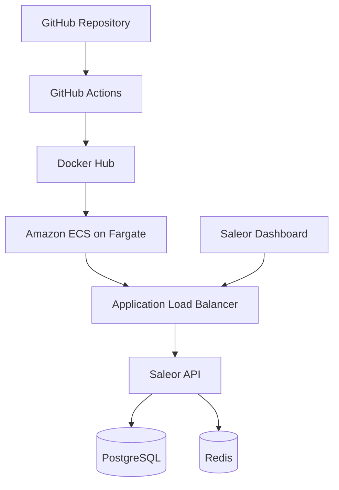

# Saleor DevOps with AWS Final Project

## Project Overview

This project demonstrates a complete DevOps workflow for containerizing, testing, scanning, publishing, and deploying the Saleor e-commerce platform.

The project uses Docker and Docker Compose for local development, GitHub Actions for continuous integration and delivery, Docker Hub for image storage, and Amazon ECS with AWS Fargate for cloud deployment.

## Architecture



Simplified deployment flow:

```text
GitHub
   │
   ▼
GitHub Actions
   │
   ▼
Docker Hub
   │
   ▼
Amazon ECS (Fargate)
   │
   ▼
Application Load Balancer
   │
   ▼
Saleor Application
```

## Technologies Used

- Git and GitHub
- GitHub Actions
- Docker
- Docker Compose
- Docker Hub
- Python 3.12
- Poetry
- Ruff
- pip-audit
- Trivy
- Saleor API
- Saleor Dashboard
- PostgreSQL
- Redis
- Mailpit
- Jaeger
- Amazon ECS
- AWS Fargate
- Application Load Balancer
- Amazon CloudWatch

## Local Application Services

| Service | Local address | Purpose |
|---|---|---|
| Saleor API | `http://localhost:8000` | Main Saleor backend and GraphQL API |
| Saleor Dashboard | `http://localhost:9000` | Administrative dashboard |
| Mailpit | `http://localhost:8025` | Local email testing |
| Jaeger | `http://localhost:16686` | Distributed tracing |
| PostgreSQL | Port `5432` | Application database |
| Redis | Port `6379` | Cache and message broker |

## CI/CD Branch Strategy

The project uses three deployment branches:

| Branch | Docker image tag |
|---|---|
| `develop` | `charlie1979/saleor-api:develop` |
| `staging` | `charlie1979/saleor-api:staging` |
| `production` | `charlie1979/saleor-api:production` |

Each branch has its own GitHub Actions workflow.

## CI/CD Pipeline

When code is pushed to one of the deployment branches, GitHub Actions performs the following steps:

1. Checks out the repository.
2. Configures Python.
3. Installs the required analysis tools.
4. Runs Ruff for Python code-quality checks.
5. Exports Poetry dependencies.
6. Runs `pip-audit` to check Python dependencies.
7. Builds the Saleor API Docker image.
8. Scans the image with Trivy.
9. Starts the application with Docker Compose.
10. Tests the Saleor API.
11. Logs in to Docker Hub.
12. Pushes the image with the correct environment tag.
13. Stops the temporary Compose environment.

## AWS Deployment

The production image is deployed to Amazon ECS.

The AWS deployment includes:

- ECS cluster: `saleor-production-cluster`
- ECS task definition: `saleor-production`
- Fargate launch type
- ECS service
- Application Load Balancer
- Target group
- Security groups
- CloudWatch logging
- Saleor API container
- PostgreSQL container
- Redis container
- Saleor Dashboard container
- Mailpit container

The Application Load Balancer accepts incoming HTTP traffic and forwards it to the Saleor API container running in ECS.

## Database Initialization

Saleor requires database migrations before it can serve requests successfully. The API container startup process runs Django migrations before starting Gunicorn.

Example startup sequence:

```dockerfile
CMD ["sh", "-c", "until python manage.py migrate --noinput; do echo 'Waiting for PostgreSQL...'; sleep 5; done; exec gunicorn --bind :8000 --workers 4 --worker-class saleor.asgi.gunicorn_worker.UvicornWorker saleor.asgi:application"]
```

This allows the application to wait for PostgreSQL, create the required database tables, and then start the web server.

## Local Setup

### Prerequisites

- Git
- Docker Desktop
- Docker Compose

### Clone the repository

```bash
git clone <repository-url>
cd codeyou-final-project
```

### Validate the Compose file

```bash
docker compose config
```

### Start the application

```bash
docker compose up -d
```

### Check the containers

```bash
docker compose ps
```

### View logs

```bash
docker compose logs
```

### Stop the application

```bash
docker compose down
```

## Challenges Solved

During this project, several real-world DevOps problems were identified and corrected:

- Docker daemon connection errors
- Intel Mac memory limitations
- Docker disk-space errors
- Incorrect Docker build paths
- Invalid Docker image tags
- Incorrect GitHub secret names
- YAML indentation errors
- Docker Compose health-check failures
- Missing database migrations
- Unhealthy ECS target-group checks
- Missing or unavailable AWS account resources
- ECS service-linked role and task-role configuration

Solving these problems demonstrated the importance of logs, validation commands, health checks, environment configuration, and systematic troubleshooting.

## Verification

The project can be verified using the following evidence:

- Green GitHub Actions workflows for develop, staging, and production
- Docker Hub repository containing all three image tags
- ECS cluster and service
- ECS task in the Running state
- Registered ECS task definition
- Application Load Balancer and target group
- CloudWatch logs
- Accessible Saleor application endpoint

## What I Learned

This project provided practical experience with the complete DevOps lifecycle:

- Containerizing a multi-service application
- Managing local services with Docker Compose
- Building automated CI/CD workflows
- Running security and dependency scans
- Publishing images to a container registry
- Deploying containers with Amazon ECS and Fargate
- Routing traffic through an Application Load Balancer
- Reading logs and diagnosing deployment failures
- Correcting database and health-check issues
## Project Documentation

Additional documentation for this project is available in the `documentation` folder.

- Project Summary
- Architecture Diagram
- Presentation Script
- Deployment Proof

The final presentation can be found in the `presentation` folder.

## Author

Created as a Code:You DevOps with AWS final project by Dale Murphy
